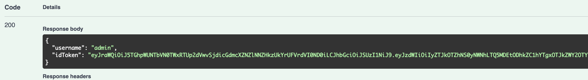

# Remote Patient Monitoring System

## what is this?

This system allows patients undergoing home or accommodation treatment to enter the necessary fields on their smartphones, making it easier for the public health center to understand the patient's health status.

For background information,[BACKGROUND.md](docs/BACKGROUND.md)Please also take a look.

## For those who help

This system is currently being developed without compensation, and we are looking for contributors.

Please check the Issues list the tasks you would like to help.
If you are able to help, please be sure to read [CONTRIBUTING.md] (docs/CONTRIBUTING.md).

Furthermore, since it is difficult to operate a production environment on a volunteer basis, please note that from the stage where development progresses to a certain extent, a corporation with operational capabilities will be able to maintain/operate the system as a contracted project from local governments, etc.
## Swagger UI
You can run the staging API from [Swagger UI](https://codeforjapan.github.io/remote-patient-monitoring-api/).

First, log in using the User/Password indicated by `/api/admin/login`.
If successful, `idToken` is returned.

You can test the API by setting the value of `idToken` returned here to the `APIGatewayAdminAuthorizer (apiKey)` of the window that appears at the end of the `Authorize` button.
Similarly, if you use `idToken`, which will return if you use `Nurse`, created with `/api/admin/centers/{centerId}/nurses/` or `Patient`, created with `/api/admin/centers/{centerId}/patients/`, you can paste a login session with another Authorizer.

## About the development environment

Please check [DEVELOPMENT.md] (docs/DEVELOPMENT.md).

## System Overview

![System Overview] (docs/images/system-overview.png)

*This system covers areas enclosed in red.

For more information, see [System Specifications] (docs/SPECIFICATION.md).

This repository is for overall issue management and API server development.
For the dashboard for public health nurses, click [remote-patient-monitoring-dashboard](https://github.com/codeforjapan/remote-patient-monitoring-dashboard)
For information on patient clients, see [remote-patient-monitoring-client](https://github.com/codeforjapan/remote-patient-monitoring-client).

## Past progress

| Date | Contents |
| ----| -----| -----|
| 2021/04/30 | First implementation has been completed and tests are conducted at a health center in Hokkaido. It generally receives high ratings. Under adjustments for the future |
| 2021/01/30 | Create a URL for staging the server. (The API functions themselves are not finished yet) |
| 2020/12/30 | 80% of the use case and wire frame are completed. Beginning development. Divide the repository into three |
| 2020/12/26 | Create this repository |
| 2020/12/23 | Volunteer team meeting with Okumura will be held, and system requirements will be roughly determined |
| 2020/12/14 | In response to Professor Okumura's appeal, the investigation begins |

## License

It's GNU AGPL v3.

## CONTRIBUTORS
Please check [docs/CONTRIBUTORS.md] (docs/CONTRIBUTORS.md).