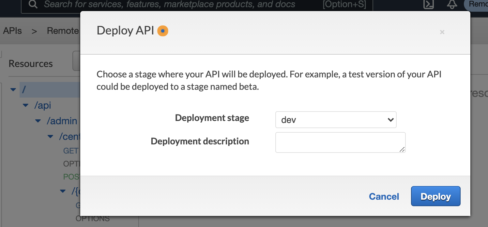
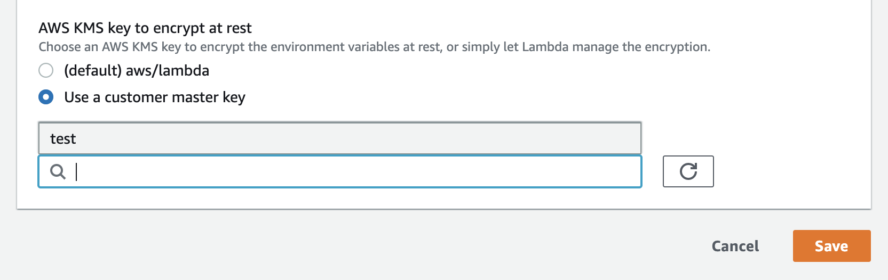
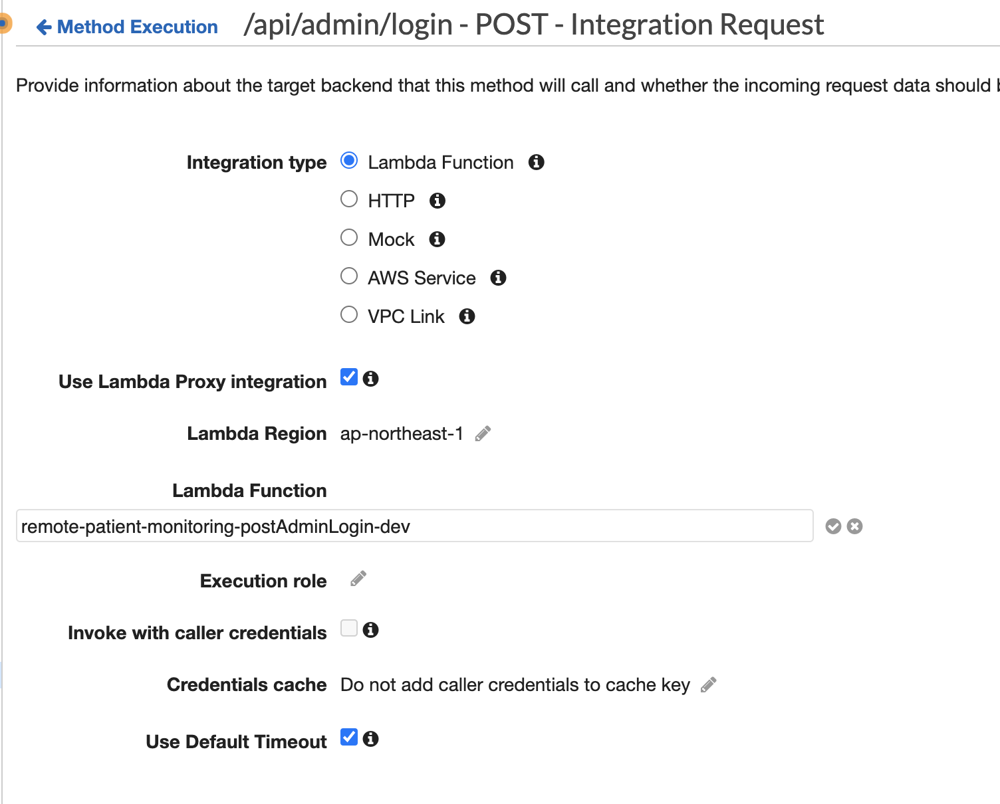
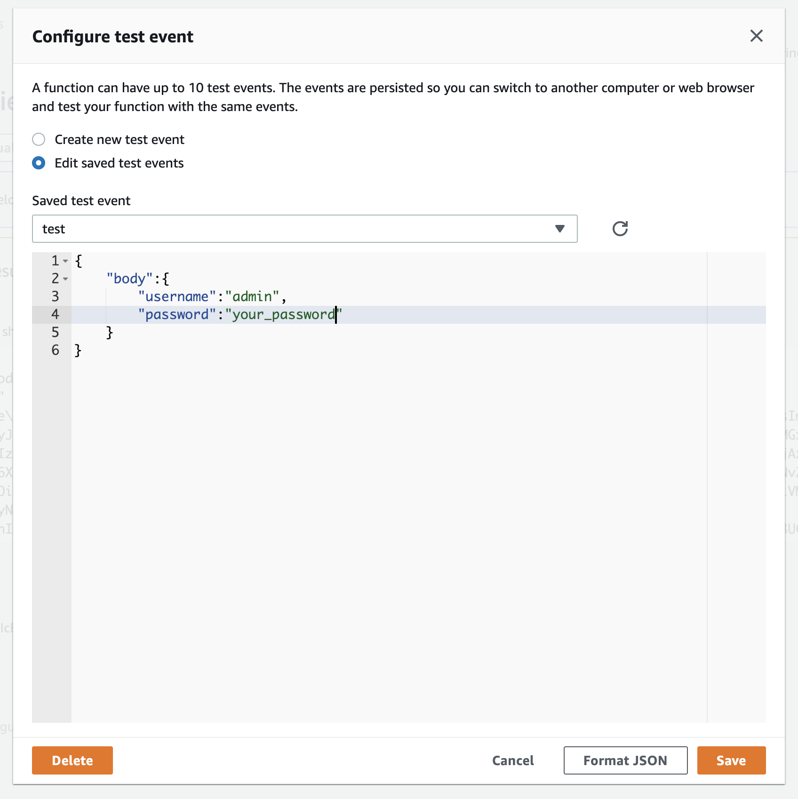

# Set up environment

We have compiled articles from people who installed it on a trial basis, so please refer to this as well.
-[I tried deploying Code for Japan's remote caretaker monitoring system to AWS] (https://zenn.dev/garasubo/articles/4336405b222c7b9de1b2)
-[remote-patient-monitoring-api installation note](https://note.com/siumaiuma/n/n2dd3f3d9a8ab)
-[cecake0141/remote-patient-monitoring-api-installation-note](https://github.com/icecake0141/remote-patient-monitoring-api-installation-note/wiki)


## install dependencies

*Serverless
*node version 12.x
*jq
*sed

### 1. Setup aws-cli
Follow [this AWS instruction](https://docs.aws.amazon.com/ja_jp/cli/latest/userguide/install-cliv2.html)

After installing the AWS CLI, use `aws configure` to configure the settings.
You will need an access key ID and a secret access key, so please refer to the "Access Key ID and Secret Access Key" section of [This document] (https://docs.aws.amazon.com/ja_jp/cli/latest/userguide/cli-configure-quickstart.html).
Also, the region is `ap-northeast-1` (Tokyo).

````bash
aws configure --profile your-profile-name
export AWS_PROFILE="your-profile-name"
````

### 2. Install Serverless environment
`npm install`

### 3. Edit environment settings

Please change the Bucket name as it is globally unique and the domain name is region-specific.

config/dev.json

````bash
{
  "AuthAdminUserPoolDomain":"your-api-domain-admin",
  "AuthNurseUserPoolDomain":"your-api-domain-nurse",
  "AuthPatientUserPoolDomain":"your-api-domain-patient",
  "OauthCallbackURL":"https://your.callback.url",
  "OauthSignoutURL":"https://your.signout.url",
  "Bucket":"testbucket45678876",
  "DebugMode":"on"
  "DBPrefix":"RemotePatientMonitoring-",
}
````

### 4. Setup
Create two types of CloudFormation Stack: Set up Dynamo DB and create a Lambda Function and API Gateway.

If you want to deploy all at once

````bash
npm run deploy
````

When deploying something other than DynamoDB

````bash
npm run deploy:all-gateway
````

### 5. Confirm admin user

Create a file called `util/.secret.json` and set the following contents:

````json
{
  "auth_user":"Admin username",
  "auth_pass":"The password you want to set" (8 characters or more, half-width alphanumeric lowercase, half-width alphanumeric uppercase, and symbols always include one character)
}
````

Setting the following command will set up an administrator account:

````bash
npm run createAdmin
````

Finally, you will see an IdToken, so please copy it. (Use in step 7)
### 6, run Test


By typing the following command, the E2E test (`/test/e2e/fullspec.test.ts`) will be executed.
Tests that have not yet been implemented are `skip`.

````bash
npm run test:e2e
````

If you get a Network Error, try the following:
If get Authkey(`/api/admin/login`) fails, all subsequent tests will fail, so it's best to check first.

deploy the API



If Network Error appears even in the above section, select `Environment variables` in the lambda management screen of the corresponding API, change the AWS KMS Key settings to an appropriate key, then return to `default`.

If lambda seems to work and you get a Network Error, try selecting the API from the API Gateway and testing. If `Invalid permissions on Lambda function` fails, try checking the lambda function again in the `Integration Request` setting.



### 7. Access the Swagger UI

The following command opens the Swagger UI: You can log in using the username/password created in step 5.

````bash
npm run openSwaggerUI
````

If you want to access an API that requires Authorize, you will need to enter the contents of `IdToken` that you obtained in step 5 from the `Authorize` button.
You may not be able to do well by tapping the API from SwaggerUI. If that's the case, try running test directly from the AWS console, passing the parameters in Swagger to Lambda. If the error still occurs, the authentication information at Lambda is often incorrect. Try the method in Step 6.



## Development information

### Test user for client development

Running npm run test:e2e creates `testNurse` and `testPatient`. The password will be displayed at the end.

```:bash
 console.log
    testNurse password is: 5n24uptq

      at test/e2e/fulltest.spec.ts:782:13

  console.log
    testPatient password is: pmxq23v1
````

### Run E2E test
When you hit the following command, `/test/e2e/fullspec.test.ts` will be executed.
Tests that have not yet been implemented are `skip`.

````bash
npm run test:e2e
````

If you want to watch changes to a file

````bash
npm run test:e2e:watch
````


### local development

#### Installing DynamoDB in a Local Environment

Install Dynamo DB

````bash
sls dynamodb install
````

#### Start a local instance of DynamoDB

````bash
npm run dynamodb:start
````

`migrations` Below is the seed data that is initially submitted.

#### Testing lambda locally

````bash
npm run test:local
````
`test/lambda` Perform the following tests: You must have a local instance of DynamoDB.

#### Run function from the command line

````bash
# Run getCenters
serverless invoke local --function getCenters
# Pass path parameter
serverless invoke local --function getCenter --data '{ "pathParameters": {"centerId":"c2c43259-2708-4f4f-98d4-d57f72ecac70"}}'
# body Passing data
serverless invoke local --function postCenter --data '{ "body":{"centerName":"test4"}}'
# If you want to pass both
serverless invoke local --function putCenter --data '{ "pathParameters": {"centerId":"ccbcebd7-3186-43c2-9cc0-ff6e83ed9dd8"}, "body":{"centerName":"mycenter1"}}'
````

### deploy

#### Modify the API and serverless.yml and redeploy

````bash
npm run deploy:gateway
````

## Building a staging environment

Create a stg.json file

`cp config/stg.json.sample config/stg.json`

Make the necessary settings

`vi config/stg.json`

deploy
## Uninstall

### Delete all

````bash
npm run remove:all
````

### Delete everything and reinstall

````bash
npm run redeploy-all
````

### Delete API only
````bash
npm run remove:gateway
````

### Delete only DynamoDB

````bash
npm run remove:dynamodb
````