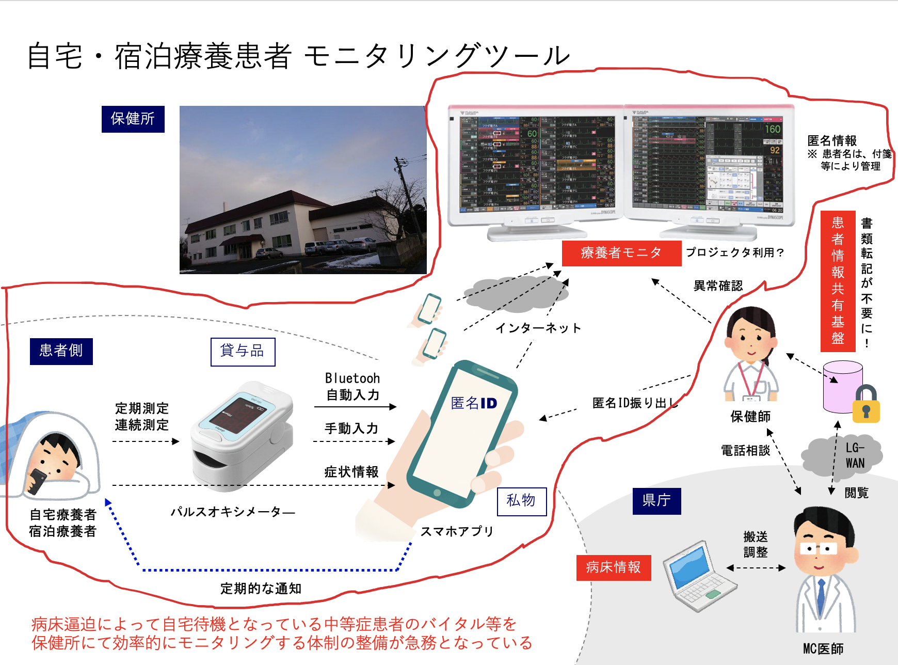
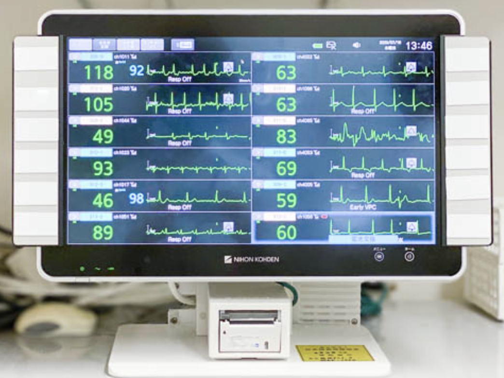

# System Specifications

The area surrounded by red is the scope of this system

For background information, please also see [BACKGROUND.md] (BACKGROUND.md).

## Patient System

*The patient enters the necessary information online or via the app and sends it to the server.
*Smartphones allow patients to use their own
*In some way, you need to set the anonymous ID given to you by the health center (do you also need a password to prevent pranks)
*Regularly enter information obtained with a pulse oximeter, body temperature, symptoms, etc.
  *Pulse oximeters allow you to obtain oxygen saturation and pulse
  *Enter the symptoms too
*For high-risk patients, consider giving them a Bluetooth-enabled pulse oximeter and smartphone to automatically suck up data.

![Client-side wireframe] (images/clinet-flow.png)

Check the Figma below for the latest wire frames
[Wireframe](https://www.figma.com/file/29X7k8bKfFlWS6Md5BhrME/UI-Template-Copy?node-id=41%3A0)
## Health Center System

*You can see a list of the patients in charge at each health center
  *It is thought that a function to issue anonymous IDs to patients is necessary (assuming that the patient is issued at the time of medical treatment)
  *Allows patients to be given a nickname (assuming it is not personal information)
*Scroll to view the number of patients as it could exceed 100 in one health center
*Raise an alert when:
  *Does the vital information fit within the specified range?
  *Is the data out of reach?
*Change the color of the text when the vital exceeds a certain threshold
*I would like to display a graph of the temperature

![Server-side wireframe] (images/server-flow.png)

Check the Figma below for the latest wire frames
[Wireframe](https://www.figma.com/file/29X7k8bKfFlWS6Md5BhrME/%E9%81%A0%E9%9A%94%E7%99%82%E9%A4%8A%E8%80%85%E3%83%A2%E3%83%8B%E3%82%BF%E3%83%AA%E3%83%B3%E3%82%B0%E3%82%B7%E3%82%B9%E3%83%86%E3%83%A0?node-id=0%3A1)

## Reference

Image of a central monitor used in hospitals, etc. (This screen has a fixed patient, but this time it cannot fit on one screen, so I consider scrolling it)
